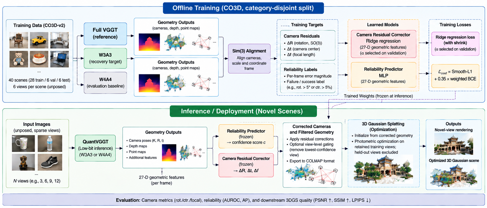
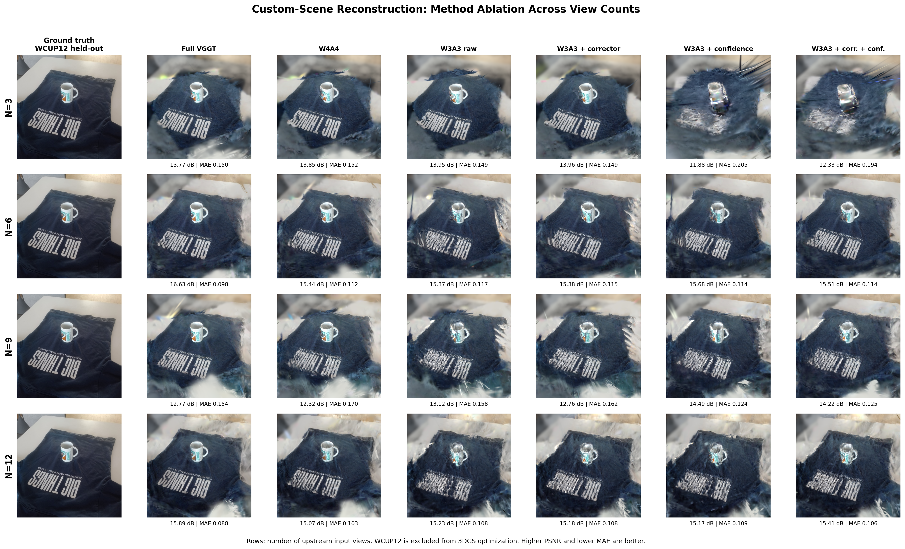

# QuantSplat: Reliability-Aware Low-Bit VGGT for Sparse-View 3D Gaussian Splatting

**QuantSplat** studies how low-bit **VGGT** affects downstream **3D Gaussian Splatting (3DGS)** and whether lightweight reliability/correction modules can recover useful geometry.

**Live demo:** https://quantsplat.arham061.workers.dev/  
**Experiment ledger:** [`experiments/README.md`](experiments/README.md)  
**Final learned-recovery bundle:** [`experiments/059_prabin_learned_confidence_residual_downstream/`](experiments/059_prabin_learned_confidence_residual_downstream/)

## Research question

> Can lightweight reliability prediction and camera correction recover useful 3D reconstruction quality when VGGT is aggressively quantized?

| Variant | Meaning |
|---|---|
| Full VGGT | full-precision reference |
| W4A4 | 4-bit weights / 4-bit activations |
| W3A3 | 3-bit weights / 3-bit activations |
| W3A3 + corrector | learned residual correction of rotation / camera center / focal length |
| W3A3 + confidence | learned reliability used for diagnostics / hard view gating |
| W3A3 + both | correction + confidence gating |

## What we used / changed / evaluated

| | |
|---|---|
| **Used** | pretrained VGGT geometry + 3D Gaussian Splatting |
| **Changed** | low-bit VGGT variants; learned reliability predictor; learned camera residual corrector; confidence-based view selection |
| **Evaluated** | camera error, confidence AUROC/AP, PSNR, SSIM, LPIPS, MAE, view-count sensitivity, failure cases, runtime/memory |

## Pipeline



*Final training and deployment pipeline for reliability-aware low-bit VGGT reconstruction.*

## Data and protocol

The learned recovery modules use **40 CO3D scenes**:

| Split | Scenes | Frames |
|---|---:|---:|
| Train | 28 | 168 |
| Validation | 6 | 36 |
| Untouched category-disjoint test | 6 | 36 |

Untouched test categories: **book, cake, donut**.

Additional downstream evaluation uses captured **cup** and **bottle** scenes plus a 12-view custom scene for `N ∈ {3,6,9,12}`.

Camera disagreement is measured after scene-level **Sim(3)** alignment to Full VGGT. Captured-scene evaluation targets are excluded from **3DGS photometric optimization**; their cameras may still come from the upstream multi-view VGGT pass, so these are **3DGS-held-out** rather than fully blind camera tests.

---

# Main results

## 1) W3A3 primarily damages camera geometry

Untouched category-disjoint test:

| Method | Rotation error ↓ | Center error ↓ | Focal error ↓ |
|---|---:|---:|---:|
| W4A4 | **1.19°** | **1.71%** | **2.32%** |
| W3A3 | 2.19° | 3.48% | 13.48% |
| W3A3 + corrector | 2.12° | 3.35% | **4.01%** |

The corrector improves rotation / center / focal error on **23 / 24 / 35 of 36** test frames.

## 2) Learned reliability beats analytic consistency

| Confidence source | AUROC ↑ | AP ↑ |
|---|---:|---:|
| Analytic consistency | 0.371 | 0.388 |
| **Learned predictor** | **0.730** | **0.706** |

Drop-one-frame camera study:

| Policy | Rotation ↓ | Center ↓ | Focal ↓ | Failure ↓ |
|---|---:|---:|---:|---:|
| All 6 | 2.643° | 4.476% | 13.453% | 41.7% |
| Learned drop | **2.559°** | 4.391% | **13.227%** | 40.0% |
| Oracle drop | 2.564° | **3.952%** | 13.454% | **30.0%** |

## 3) End-to-end captured-scene reconstruction

Six captured views; one view held out from 3DGS optimization:

| Method | PSNR ↑ | MAE ↓ |
|---|---:|---:|
| Full VGGT | **19.971** | **0.0642** |
| W4A4 | 18.608 | 0.0737 |
| W3A3 raw | 15.763 | 0.1055 |
| **W3A3 + corrector** | **16.466** | **0.0956** |
| W3A3 + confidence | 15.103 | 0.1183 |
| W3A3 + both | 15.513 | 0.1117 |

Residual correction recovers **+0.70 dB** over raw W3A3 here; hard gating hurts because the scene has little view redundancy.

## 4) View-count ablation

Fixed target; PSNR in dB:

| Method | N=3 | N=6 | N=9 | N=12 |
|---|---:|---:|---:|---:|
| Full VGGT | 13.77 | **16.63** | 12.77 | **15.89** |
| W4A4 | 13.85 | 15.44 | 12.32 | 15.07 |
| W3A3 raw | 13.95 | 15.37 | 13.12 | 15.23 |
| W3A3 + corrector | **13.96** | 15.38 | 12.76 | 15.18 |
| W3A3 + confidence | 11.88 | **15.68** | **14.49** | 15.17 |
| W3A3 + both | 12.33 | 15.51 | 14.22 | **15.41** |

Key observation: hard rejection is harmful at `N=3`, but at `N=9` confidence improves raw W3A3 from **13.12 → 14.49 dB**.



## 5) Visual stability

Three fixed held-out views:

| Method | PSNR ↑ | SSIM ↑ | LPIPS ↓ |
|---|---:|---:|---:|
| Full VGGT | **21.29** | **0.721** | **0.320** |
| W4A4 | 19.23 | 0.602 | 0.387 |
| W3A3 raw | 18.05 | 0.512 | 0.514 |
| W3A3 + corrector | 18.01 | 0.516 | **0.486** |
| W3A3 + confidence | 17.62 | 0.498 | 0.502 |
| W3A3 + both | **18.16** | **0.523** | 0.487 |

## 6) Negative replication: better cameras ≠ automatically better 3DGS

Independent bottle scene:

| Method | PSNR ↑ |
|---|---:|
| **W3A3 raw** | **13.98** |
| W3A3 + corrector | 13.41 |
| W3A3 + confidence | 12.52 |
| W3A3 + both | 12.23 |

This negative result is retained deliberately: improving upstream camera agreement is **not sufficient** to guarantee a better 3DGS optimum.

---

# Additional experiments from the full study

The repository contains **60 numbered experiment folders (000–059)**. The table below highlights results that add mechanism or debugging evidence beyond the final report.

| Exp. | Experiment | Headline result |
|---:|---|---|
| [025](experiments/025_w2a4_calibrated_locally_the_pose_head_collapses/) | W2A4 stress test | camera spread collapses to **1.0% of full**; LOO camera error rises **0.079 → 5.296** scene radii — 2-bit breaks pose rather than producing a mildly degraded model |
| [027](experiments/027_w4a4_ablation_five_arms_measured_the_hadamard/) | W4A4 component ablation | removing the QuaRot/Hadamard rotation changes camera rotation error **1.205° → 2.469°** and point error **0.040 → 0.081**; geometry-only result |
| [035](experiments/035_w4a4_point_error_splits_into_thirds_depth/) | W4A4 error decomposition | world-point error is approximately split between **depth shape, per-view scale drift, and cameras**; per-view depth-scale drift ≈ **1.3%** |
| [045](experiments/045_input_order_ensembling_gives_a_deployable_confidence/) | Training-free uncertainty | W4A4 pose spread across input orderings predicts pose error with **Spearman ρ = 0.880, p ≈ 7×10⁻¹⁴** |
| [054](experiments/054_camera_rotation_bug_quaternion_conjugate_in_rotmat2qvec/) | Camera-conversion audit | found/fixed a quaternion-conjugation bug; corrected 8-scene means: **Full 14.574 dB vs W3A3 12.983 dB** |
| [055](experiments/055_point_confidence_on_corrected_cameras_oracle_and/) | Point-confidence upper bound | even oracle point pruning gives only **+0.159 dB** over W3A3 (`p=0.30`); learned pruning is worse, arguing against point pruning as the main recovery mechanism |

### Important evaluation note

Experiment [054](experiments/054_camera_rotation_bug_quaternion_conjugate_in_rotmat2qvec/) discovered that pre-fix 3DGS runs in experiments `001–053` used conjugated camera rotations. Their **rendering metrics are historical/invalid**, while their geometry-only analyses remain usable. The repository keeps them for auditability. Post-fix rendering experiments are used for the corrected downstream results.

For the full audit trail, see [`experiments/README.md`](experiments/README.md) and [`experiments/PAPER_EVIDENCE.md`](experiments/PAPER_EVIDENCE.md).

---

# Efficiency

Generic six-view implementation:

| Variant | Forward time | Peak allocated GPU memory |
|---|---:|---:|
| Full VGGT | **1.12 s** | **9893 MiB** |
| W4A4 | 2.19 s | 15381 MiB |
| W3A3 | 2.19 s | 15381 MiB |

These numbers describe this implementation, not intrinsic low-bit hardware speed. Packing/dequantization and non-native low-bit execution dominate; specialized kernels are required to realize the expected efficiency benefit.

---

# Demo

**Hosted:** https://quantsplat.arham061.workers.dev/

The interactive frontend is in [`Clean_w3a3/quantsplat_frontend/`](Clean_w3a3/quantsplat_frontend/). A CPU-only precomputed experiment explorer is in [`Clean_w3a3/quantsplat_demo/`](Clean_w3a3/quantsplat_demo/).

## Run the frontend locally

```bash
git clone https://github.com/SunlightWings/3D-Reconstruction.git
cd 3D-Reconstruction/Clean_w3a3/quantsplat_frontend
cp .env.example .env.local
npm install
npm run dev
```

Open `http://localhost:5173`.

## Run the precomputed explorer

```bash
cd Clean_w3a3/quantsplat_demo
python3 -m venv .venv
source .venv/bin/activate
python -m pip install -r requirements.txt
python app.py
```

Open `http://localhost:7860`.

Detailed setup is kept in the component READMEs:
- [`quantsplat_frontend/README.md`](Clean_w3a3/quantsplat_frontend/README.md)
- [`quantsplat_demo/README.md`](Clean_w3a3/quantsplat_demo/README.md)

---

# Reproducibility

The experiment tree is intentionally research-log style: each numbered folder stores the experiment rationale/config plus available code, results and logs.

Start here:

- [`experiments/README.md`](experiments/README.md) — complete numbered experiment ledger
- [`experiments/059_prabin_learned_confidence_residual_downstream/PROVENANCE.md`](experiments/059_prabin_learned_confidence_residual_downstream/PROVENANCE.md)
- [`experiments/059_prabin_learned_confidence_residual_downstream/MANIFEST.txt`](experiments/059_prabin_learned_confidence_residual_downstream/MANIFEST.txt)
- [`experiments/059_prabin_learned_confidence_residual_downstream/results/`](experiments/059_prabin_learned_confidence_residual_downstream/results/)
- [`experiments/059_prabin_learned_confidence_residual_downstream/figures/`](experiments/059_prabin_learned_confidence_residual_downstream/figures/)
- [`3D_Reconstruction.ipynb`](3D_Reconstruction.ipynb) — earlier reconstruction notebook

Large prediction/3DGS artifacts are not all committed because of repository-size limits; experiment folders document provenance and available result files.

## Repository map

```text
3D-Reconstruction/
├── README.md
├── 3D_Reconstruction.ipynb
├── Clean_w3a3/
│   ├── code/                 # quantization / geometry / downstream code
│   ├── datasets/
│   ├── quantsplat_frontend/  # interactive web frontend
│   └── quantsplat_demo/      # precomputed experiment explorer
└── experiments/
    ├── 000_... → 059_...     # numbered research experiments
    ├── README.md             # experiment index
    └── PAPER_EVIDENCE.md     # consolidated evidence / caveats
```

# Takeaways

| Evidence | Conclusion |
|---|---|
| W4A4 camera error is small | **W4A4 is the safer quality-oriented operating point** |
| W3A3 focal error: 13.48% → 4.01% after correction | aggressive quantization error is partly structured/correctable |
| learned confidence AUROC 0.730 | unreliable W3A3 geometry is predictable |
| gating helps at N=9 but hurts at N=3 | reliability must be balanced against view coverage |
| bottle replication degrades with recovery modules | camera-level improvement does not guarantee 3DGS improvement |
| W2A4 camera spread collapses to 1% | quantizing harder can produce catastrophic pose-head failure |
| generic low-bit path is not faster | practical speedups require appropriate kernels |

# Team

Computer Vision Course Project — University of Technology Nuremberg

- **Prabin Sharma Poudel**
- **Mohan Manideep Danda**
- **Arham Shahzad**

Canonical repository: https://github.com/SunlightWings/3D-Reconstruction  
Submission fork: https://github.com/arham061/3D-Reconstruction
