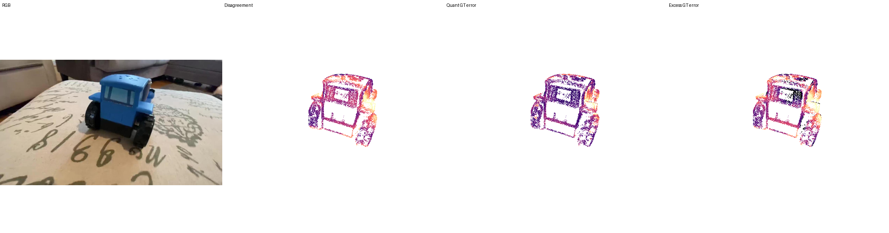
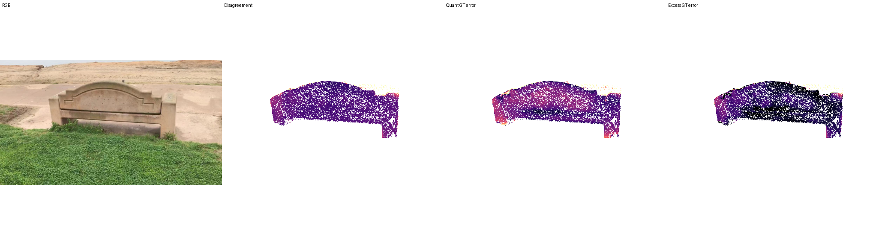
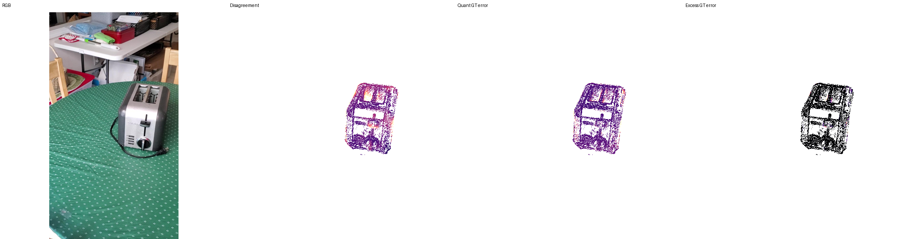

# Full-vs-W4A4 Geometric Disagreement Analysis

## 1. Objective

Where does W4A4 QuantVGGT differ from Full VGGT, and does that difference correspond to geometry degraded by quantization? The target is not to equate disagreement with error, but to test whether it is useful offline supervision for quantization-induced risk.

## 2. Why this experiment was needed

The earlier controlled toilet 3DGS study motivates this question: with the same inputs and matched 518 adapter, held-out content PSNR was 10.606 dB for W4A4 and 13.084 dB for Full (+2.478 dB); all nine held-out views favored Full (SSIM 0.46147/0.52455; LPIPS 0.60021/0.46200). The three-scene GT study below does **not** measure 3DGS performance; it tests the upstream geometric reliability signal.

## 3. Controlled experiment

Three CO3D scenes were frozen before result inspection: toytruck `190_20494_39385` frames `[1,41,75,123,162,202]`; bench `415_57112_110099` and toaster `372_41229_82130` frames `[1,41,81,122,162,202]`. Full and W4A4 consumed the same saved 6×3×518×518 pad/no-crop tensor for each scene, the same base checkpoint provenance, and the same output conversion. There was no BA, tracking, confidence filtering, GT optimization, or per-frame alignment.

## 4. Ground-truth validation

CO3D `uint16` depth PNG values encode float16 bit patterns. We reinterpret the bits as float16, convert to float32, and multiply by `scale_adjustment`. With that corrected decoder, GT depth/camera unprojection agrees with the official point clouds at median NN 0.3524% (toytruck), 0.1751% (bench), and 0.2989% (toaster) of robust scene radius.

## 5. Error definitions

One global proper Sim(3) per model per scene is fitted **only** from six matching camera centres. If `P_model = s(A P_GT)+b`, model points are inverse-mapped into GT coordinates before comparison. At a valid pixel `u`:

`d(u) = ||P_Q(u) - P_F(u)||`  (Full–W4A4 disagreement)
`e_Q(u) = ||P_Q(u) - P_GT(u)||`  (absolute W4A4 GT error)
`e_F(u) = ||P_F(u) - P_GT(u)||`  (Full GT error)
`e_excess(u) = max(e_Q(u) - e_F(u), 0)`  (quantization-induced excess error)

All geometry distances are normalized by the robust GT scene radius.

## 6. Quantitative results

| Scene | Full camera | W4A4 camera | Full geometry | W4A4 geometry | rho(d,eQ) | rho(d,excess) | AUC eQ | AUC excess |
|---|---:|---:|---:|---:|---:|---:|---:|---:|
| toytruck | 3.562% | 7.567% | 5.337% | 9.066% | 0.5357 | 0.6268 | 0.7720 | 0.9693 |
| bench | 2.281% | 2.326% | 2.769% | 3.951% | 0.3650 | 0.4987 | 0.8728 | 0.9823 |
| toaster | 4.106% | 5.024% | 13.088% | 11.870% | -0.0100 | 0.3165 | 0.4071 | 0.8262 |

Primary pooled deterministic-sample metrics: `rho(d,eQ)=0.3790`, `rho(d,e_excess)=0.4693`, AUC top-10% eQ/excess `0.6068/0.9656`, and top-decile disagreement precision `30.58%/64.12%` for eQ/excess.

The later all-valid-pixel heatmap/localization pipeline reports `rho(d,eQ)=0.4629`, `rho(d,e_excess)=0.4430`, and 62.41% top-decile excess-localization precision. These are intentionally preserved as distinct values: they arise from the corresponding sampling/localization pipeline rather than being silently reconciled with the primary deterministic-sample analysis.

## 7. Spatial localization

The heatmap analysis processed 18 frames. W4A4-induced excess error was 2.87× the global mean at foreground object boundaries and 2.05× at GT depth discontinuities. Damage is therefore spatially structured rather than random.

Representative frames use a deterministic rule: for each scene, choose the frame with per-frame `rho(d,e_excess)` closest to that scene's median. The selected frames are toytruck 123, bench 122, and toaster 202.

| Toytruck frame 123 |
|---|
|  |

| Bench frame 122 |
|---|
|  |

| Toaster frame 202 |
|---|
|  |

## 8. Toaster counterexample

Toaster must not be hidden: W4A4 has lower median absolute 3D error than Full (11.870% versus 13.088%). Accordingly, disagreement is not an absolute Quant-error predictor there (`rho=-0.0100`, AUC 0.4071). It nevertheless retains signal for positive quantization-induced excess error (`rho=0.3165`, AUC 0.8262). This is why excess-risk supervision is the more defensible target.

## 9. Interpretation and decision

Full–W4A4 disagreement is a scene-dependent predictor of total QuantVGGT error but a substantially more reliable indicator of quantization-induced excess geometric error. It is not quantization error itself and cannot distinguish cases where Quant improves on Full.

- Absolute Quant error supervision: **MIXED**.
- Quantization-induced uncertainty supervision: **SUPPORTED / PROCEED**.

Use disagreement as an offline supervision signal for quantization-induced risk, not as a calibrated estimate of total reconstruction error.

## 10. Limitations

Only three GT scenes are available and pixels within frames are correlated. W4A4 is simulated/fake quantization; Full is an imperfect teacher; behavior is scene-dependent; and boundary/depth-transition concentration requires broader validation before universal claims.

## 11. Reproduction and provenance

See [EXPERIMENT_SETUP.md](EXPERIMENT_SETUP.md), [PROVENANCE.md](PROVENANCE.md), and the compact files in [`results/disagreement_analysis`](../../results/disagreement_analysis/).
